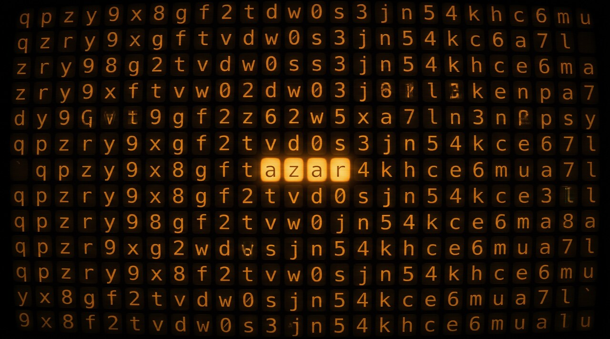

<div align="center">



[](https://github.com/aficiomaquinas/azar/actions/workflows/ci.yml)
[](https://github.com/aficiomaquinas/azar/releases/tag/v0.1.0)

[](https://github.com/aficiomaquinas/azar/releases)
[](LICENSE)

**Cryptographically random, human-safe identifiers & secrets.**

</div>

Cryptographically random, human-safe identifier and secret generator.
Single static binary; the shell functions `rand32` / `rand58` are thin
wrappers around it.

## Why this exists

Every secret generator today is a compromise: web tools (blind trust in a
supply chain you cannot audit — and your secret leaving the machine), shell
one-liners gluing `openssl rand` (charset foot-guns, wrapping bugs, nothing
testable), or libraries that answer a different question (UUID/ULID/KSUID
solve *sortable identity*, not secrets).

**Don't roll your own crypto — and don't outsource your secrets to a webui
either.** The checksum and charset machinery comes from the rust-bitcoin
`bech32` crate (the BIP-350 reference implementation); entropy comes from
the operating system CSPRNG. Nothing here invents cryptography. What is new
is that a *perfectly up-to-spec* CLI for this finally exists: a fast static
binary, exact lengths, optimally dense yet human-safe charsets (no `1`, `b`,
`i`, `o` confusion), pipe-first ergonomics, fully auditable, zero network.
Your secret never leaves your machine, and you can read every line.

Cryptocurrency libraries solved this format problem years ago; the novelty
is a CLI that applies them to everyday secrets, built on standards by
default.

## Design

- **bech32m** output follows **BIP-350** (checksum constant `0x2bc830a3`)
  via the [`bech32` crate](https://crates.io/crates/bech32) (rust-bitcoin) —
  no hand-rolled crypto. The BCH checksum guarantees detection of any error
  affecting up to 4 characters (< 1e-9 false-negative beyond that).
- Entropy comes from the OS CSPRNG (`getrandom` crate — same source as
  `/dev/urandom` via the standard library path).
- Length sampling is **bit-level**: exactly 5 entropy bits per output
  character, so `--length N` is **exactly N characters, always**.
- Charset excludes `1`, `b`, `i`, `o` (visual ambiguity) and is all-lower:
  safe for double-click, URLs, and voice.

## Install

Preferred — via cargo (git until the crates.io release is cut):

```bash
cargo install --git https://github.com/aficiomaquinas/azar
```

Or grab a prebuilt static binary from
[Releases](https://github.com/aficiomaquinas/azar/releases) — `tar.gz` for
Linux (x86_64/aarch64, musl) and macOS (both arches), `.zip` for Windows,
each with a sidecar `.sha256` checksum file.

From a local checkout:

```bash
cargo install --path .
```

## Usage

```bash
azar                                 # BARE bech32m: <payload><ck6>, 256-bit (58 chars)
azar -l 12                           # exactly 12 chars, bare + checksum
azar -l 6 -n | wl-copy               # casual 6-char token, clipboard
azar -P r32                          # namespace: r321<payload><ck6> (standard form)
azar -s                              # strict: standard form + >= 128 bits
azar -f bech32 -P legacy             # classic BIP-173 checksum (needs -P)
azar -f base58 -l 15                 # base58 / base58check / base64 / hex
azar -f hex -l 7                     # odd lengths exact
echo "<token>" | azar --verify       # validates bare AND standard forms
```

## Coin flips & random integers (pipe-first, bash-native)

`--flip` prints exactly `true` or `false` — the strings `test`/`if` consume
directly. `-R MIN MAX` prints one uniform integer (rejection-sampled on the
CSPRNG, no modulo bias). Both verified against bash **and** zsh.

```bash
# branch on a fair coin
if [ "$(azar --flip)" = true ]; then echo heads; else echo tails; fi
azar --flip && do-a || do-b

# a fair die, an array index, a while-until loop
n=$(azar -R 1 6)
pick=${arr[$(azar -R 0 $((${#arr[@]} - 1)))]}
until [ "$(azar --flip)" = true ]; do :; done

# negative ranges work too (azar -R parses negative numbers)
v=$(azar -R -10 -2)

# five flips in a stream
seq 1 5 | xargs -I{} azar --flip
```

Effective entropy with `-l` is 5 bits per payload char (the 6 checksum
chars carry none); `--strict` enforces >= 128 effective bits and the
standard (prefixed) form. All errors go to stderr with exit code 1.

## Shell wrappers

`~/.config/shell/functions.sh` (repo `shell-config`) wraps this binary:

```sh
rand32()  { exec azar "$@"; }
rand58()  { exec azar -f base58 "$@"; }   # transitional; maps flags
```

## Development

```bash
cargo test        # unit + BIP-350 vectors (incl. exhaustive single-char
                  # mutation detection) + proptest length contracts
cargo clippy -- -D warnings
cargo fmt --check
cargo audit
```

## License

MIT
